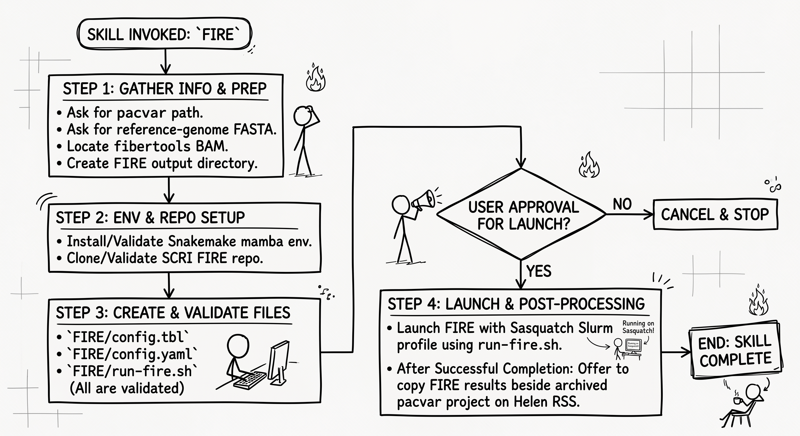

# SCRI nf-core Agent Skills

This repository contains AI-agentic (CodeX or Gemini) skills for preparing and running nf-core pipelines in the Seattle Children's Research Institute (SCRI) Sasquatch HPC environment.

Each supported nf-core pipeline has its own directory and `SKILL.md`. Planned pipeline-specific skills include pacvar, ATAC-seq, and CUT&RUN.

Each skill will guide users through locating or constructing the files and environment required for that pipeline:

1. a mamba environment containing Nextflow;
2. a customized Nextflow configuration for Sasquatch, based on resources such as [`sasquatch-nf-config`](https://github.com/chaochaowong/sasquatch-nf-config);
3. a pipeline-compatible nf-core samplesheet; and
4. a pipeline-specific `params.json` file if nesseccary.

Detailed setup, validation, and execution instructions will be maintained in each pipeline directory rather than in this README.

## Getting started
Before running an nf-core pipeline, users should create a directory on your 'assoc' space with a meaningful, self-contained name that includes the Benchling ID, cell line, treatment, sequencing assay (such as RNA-seq or CUT&RUN), and sequencing run date. This is essential if using CodeX.

Project directory naming example:
```text
<benchling-id/project-id>_<cell-line>_<treatment/codition/tumor-type>_<assay>_<YYYY-MM-DD>
```

This directory will be the output directory for the Nextflow pipeline. Users should provide its path to the AI agent.

## `pacvar` AI-agentic workflow


When the `pacvar` skill is used, the AI agent will:

1. Ask for the project directory, association (`assoc`) name, sample names and BAM/PBI paths, short project ID, custom config, mamba environment, Helen active RSS destination, and pipeline revision.
2. Create and validate `pipeline_params/nf-sample-sheet.csv`, `sasquatch-cpu-pacvar.config`, and `run-pacvar.sh`. Users should review the parameters in `run-pacvar.sh` and make any necessary changes before approving the pipeline launch.
3. After user approval, run `run-pacvar.sh` with Nextflow in the selected mamba environment and a named tmux session.
4. After confirming that the pipeline completed successfully, offer to copy the project to the designated Helen active RSS destination. Any cleanup of the temporary Nextflow work directory and tmux session requires user approval.

## `FIRE` AI-agentic workflow



When the `FIRE` skill is used, the AI agent will:

1. Ask for the pacvar path and local reference-genome FASTA file, locate the fibertools BAM, and create a `FIRE` output directory.
2. Install or validate the Snakemake mamba environment, then clone or validate the SCRI FIRE repository.
3. Create and validate `FIRE` config files: `FIRE/pipeline_config/config.tbl`, `FIRE/pipeline_config/config.yaml`, and `FIRE/pipeline_config/run-fire.sh`.
4. After user approval, launch FIRE with the Sasquatch Slurm profile using `run-fire.sh`. After successful completion, offer to copy the FIRE results beside the archived pacvar project on Helen RSS.

## `pacvar-dashboard` AI-agentic workflow

The `pacvar-dashboard` skill creates portable, per-sample interactive reports from VEP-annotated pacvar results. When it is used, the AI agent will:

1. Ask for the completed pacvar project directory and verify the available SNV, SV, BND/fusion-candidate, and CNV annotation files.
2. Generate searchable variant tables and interactive CNV and structure variants breakends (fusion) visualizations for each sample, structure variants table, and clinical relavent small variants tables.
3. Create an `index_<sampleID>.html` page that summarizes the findings and links all generated reports in a self-contained `dashboard` sub-directory.

## `pacvar + FIRE` AI-agentic workflow

The `pacvar-plus-FIRE` skill coordinates both pipelines as one ordered workflow. When it is used, the AI agent will:

1. Ask for the shared, pacvar-specific, and FIRE-specific inputs together at the beginning, including the Sasquatch association, project and sample information, Nextflow and Snakemake environments, FIRE repository and reference genome, and Helen active RSS destination.
2. Prepare and validate the pacvar run files, present them for review, and launch pacvar only after user approval.
3. Verify that pacvar completed successfully, locate the resulting fibertools BAM, and use that BAM as the input for FIRE. FIRE will not be prepared or launched from incomplete pacvar output.
4. Prepare and validate the FIRE configuration and launch script, present them for a separate review, and launch FIRE only after user approval.
5. Verify that FIRE completed successfully, then offer to archive the combined project to Helen active RSS. Data transfers require explicit confirmation and are verified after copying.
