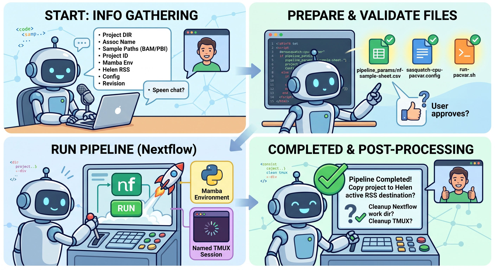

# SCRI nf-core Agent Skills

This repository contains AI-agent (Codex or Gemini) skills for preparing and running nf-core pipelines in the Seattle Children's Research Institute (SCRI) Sasquatch HPC environment.

Each supported nf-core pipeline has its own directory and `SKILL.md`. Planned pipeline-specific skills include pacvar, ATAC-seq, and CUT&RUN.

Each skill will guide users through locating or constructing the files and environment required for that pipeline:

1. a mamba environment containing Nextflow;
2. a customized Nextflow configuration for Sasquatch, based on resources such as [`sasquatch-nf-config`](https://github.com/chaochaowong/sasquatch-nf-config);
3. a pipeline-compatible nf-core samplesheet; and
4. a pipeline-specific `params.json` file if nesseccary.

Detailed setup, validation, and execution instructions will be maintained in each pipeline directory rather than in this README.

## Getting started
Before running an nf-core pipeline, users should create a directory on your 'assoc' space with a meaningful, self-contained name that includes the Benchling ID, cell line, treatment, sequencing assay (such as RNA-seq or CUT&RUN), and sequencing run date. This is essential if using CodeX.

Project directory naming example:
```text
<benchling-id/project-id>_<cell-line>_<treatment/codition/tumor-type>_<assay>_<YYYY-MM-DD>
```

This directory will be the output directory for the Nextflow pipeline. Users should provide its path to the AI agent.

## `pacvar` AI-agentic workflow



When the `pacvar` skill is used, the AI agent will:

1. Ask for the project directory, association (`assoc`) name, sample names and BAM/PBI paths, short project ID, custom config, mamba environment, Helen active RSS destination, and pipeline revision.
2. Create and validate `pipeline_params/nf-sample-sheet.csv`, `sasquatch-cpu-pacvar.config`, and `run-pacvar.sh`. Users should review the parameters in `run-pacvar.sh` and make any necessary changes before approving the pipeline launch.
3. After user approval, run `run-pacvar.sh` with Nextflow in the selected mamba environment and a named tmux session.
4. After confirming that the pipeline completed successfully, offer to copy the project to the designated Helen active RSS destination. Any cleanup of the temporary Nextflow work directory and tmux session requires user approval.
